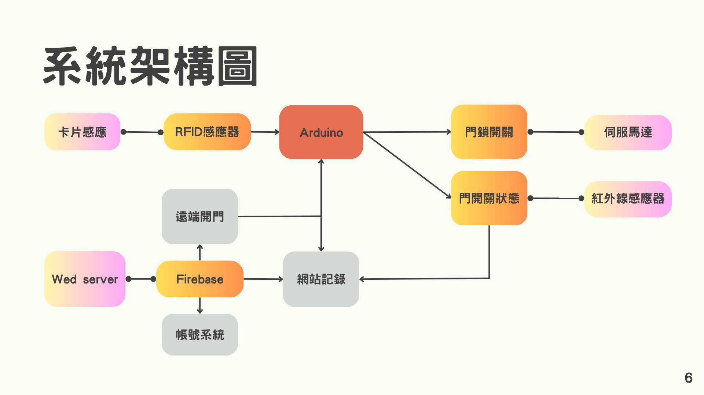

智慧門禁系統
====
使用 ESP32 開發版整合 RFID、網站等方式進行開鎖、即時監控的門禁系統。

使用 Firebase realtime database 作為資料庫，ESP32 與網頁端同時對資料庫變數更改並即時顯示門鎖狀態。

並可透過通過白名單的學生證、悠遊卡等 IC 卡開門，或使用網頁端登入帳號密碼開門，並記錄所有開關門動作的時間與人員身分。

[說明簡報，內含展示影片](https://www.canva.com/design/DAF4K5hUs-A/0c60sVON2bFGC1tac2Pprw/edit?utm_content=DAF4K5hUs-A&utm_campaign=designshare&utm_medium=link2&utm_source=sharebutton)

功能
----
* 使用 RFID (無線射頻辨識) 感應，租戶使用學生證或任何可感應卡片、磁扣即可打開門鎖
* 伺服馬達模擬門鎖
* 網站紀錄門開關狀態、時間、操作者
* 租戶可登入網站遠端開鎖
* 利用紅外線感應門的開關狀態，並顯示於網站
* Authentication、Realtime Database、Hosting

架構圖
----

